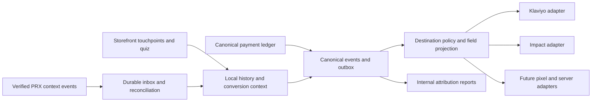

# Unified tracking, attribution and conversion contract

Implementation status: [canonical event foundation](dev.md) records internal lead/quiz events. Delivery, verified callback reconciliation and value reporting below remain planned.

2026-09-14. Proposed implementation contract for the generic admin, storefront and portal, based on the existing code at `634e802` and the operator's latest requirements. This document distinguishes current behavior from proposed work. No tracking configuration, vendor account, database, provider or application behavior was changed to prepare it.

## 1. Product decisions and data boundary

Use one local event and attribution system for every acquisition pathway and destination. Klaviyo is the selected marketing-email platform. Impact is the planned affiliate/influencer destination. Other pixels, ad platforms, partner integrations and offline sources must adopt the same event identity, attribution history, correlation and delivery contract. Vendor names belong in drivers and configured integration instances, never in generic domain event names or application defaults.

The operator confirms that the generalized protocol quiz and aspirational goals are nonclinical marketing inputs, eligible for segmentation, and reports BAAs covering information sharing between the admin/store/portal users. Honor that intended use: do not classify attribution, lead identity, goals or every server-side transaction event as PHI merely because the business also operates a clinical portal. Medical conditions, medications, medical allergies and clinical records are excluded from the marketing projection. Do not infer those attributes from PRX data for segmentation.

This is a field-and-purpose contract, not a blanket legal classification of every future field with a particular label. Whether an identifiable event relates to health, health care or payment for health care depends on its content and context; an opaque UUID or generic event name alone does not establish de-identification. HHS distinguishes tracking information that is not PHI from identifiable health-related tracking information. The plan uses the operator's approved nonclinical field set and records each destination's permitted use without assuming one agreement automatically covers every future recipient. [HHS tracking guidance](https://www.hhs.gov/hipaa/for-professionals/privacy/guidance/hipaa-online-tracking/index.html).

| Data | Treatment in the shared contract |
|---|---|
| Source/medium/campaign, approved referral/click references, landing category, generalized conversion milestone | Attribution fields; usable according to destination purpose and tracking consent settings. |
| Validated aspirational goal keys and specifically approved generalized quiz answers | Marketing segmentation fields. Snapshot the submission/schema version and question/option semantics; current question definitions alone cannot interpret renamed/deleted historical questions reliably. Version their meaning; do not export the entire answer blob. |
| Name/email/phone | Contact identity, sent only to destinations that need those fields, such as Klaviyo. Never copied automatically to every pixel. |
| DOB, exact age, measurements, sex and other existing restricted fields | Not added to this marketing contract by inference. Retain existing field policies; approving goals does not silently downgrade other fields. |
| Conditions, medications, allergies, clinical answers, notes and raw provider responses | Excluded from this marketing projection, even when available elsewhere in the local schema. |
| Provider chart/patient/encounter identifiers, credentials, claim links, session tokens | Remain internal; no outbound marketing payload. |
| Purchase value/currency and approved nonclinical order category | Eligible commerce projection; never a wholesale order/cart export. Product names, URLs, event meaning and list names must not reintroduce excluded medical content. |

## 2. What already exists

- `Lead` persists `quiz_answers`, `quiz_id`, `quiz_completed_at`, contact fields, UTM fields, referral references and checkout path. `LeadController` runs `QuizAnswerValidator` before storage; unknown questions and invisible answers are not blindly accepted. This verifies source behavior, not the contents of a live database.
- `QuizQuestionKind::HealthGoals` already defaults to `Sensitive`, **not** `Phi`. `QuizQuestion::effectiveDataClass()` supports explicit question classification. `FieldMap` resolves individual quiz fields; the opaque `quiz_answers` container is deliberately absent from the workflow field registry. Preserve this distinction.
- The general Lead schema also supports cart descriptions, notes and provider-response fields. Their existence is a reason to select explicit marketing fields, not evidence that current leads contain clinical data. Never serialize a whole Lead to a marketing event.
- `CreateLeadAction` records consent and creates the lead, attempts referral attribution, then dispatches `lead.created`. `quiz.completed` is an additional event for quiz leads. Those in-memory/queued events are useful producers, but do not themselves provide an atomic durable conversion outbox.
- `AttributeLeadAction` preserves the first assigned referral credit. For a matched visitor/referral click it replaces the UTM tuple together and retains the actual landing context. Code-only attribution is possible when visitor evidence is missing. Existing referral clicks are deduplicated per code/visitor, so repeated same-code visits are not separate touches; they are not universal all-channel touchpoint history. Storefront non-referral UTMs are read at quiz submission, while checkout lacks an independent UTM snapshot, so navigation can lose original acquisition context.
- `IntegrationRegistry`, `integration_instances`, `IntegrationIdentity`, `ConsentResolver`, `FieldMap`, `PushToIntegrationAction`, and the Klaviyo `SyncsContacts`/`TracksEvents` driver already exist. Extend these; do not build a second vendor registry or consent system. `ConsentResolver` currently resolves Lead subjects only, so Customer transitions need an explicit consent lineage/resolver extension rather than treating missing Customer consent as permission.
- `KlaviyoDriver::trackEvent()` currently sends metric/profile/properties without a stable `unique_id` or original occurrence time. Its accepted result is not proof of downstream processing. Add the durable event contract before depending on retry-safe conversion delivery. Existing workflow chains deliberately run once; retry delivery records, not the entire workflow and its other side effects.
- API checkout already sends `lead_uuid`, `cart_ulid` and selected UTM values in unified-intake metadata. `UnifiedIntakeRequestData` supports metadata. Checkout still calls PRX before storing the local order. Existing embed completion is browser-supplied, and the PRX webhook receiver deliberately does not derive lead ownership from it.
- Existing referral metrics count current captured Lead payment states and amounts, not Customer lifetime orders or reversal history. Customer provisioning and provider-instance mapping exist, and order detail now requires explicit Customer ownership. Trusted lead/Customer/order linking, all-channel attribution history, Impact delivery and the shared conversion outbox are not yet implemented.

## 3. Identities and correlation

Keep different identities separate, connected by auditable relations:

| Identity | Purpose |
|---|---|
| `visitor_id` / session | First-party browsing continuity; useful attribution evidence, never account or order authorization. |
| `lead_id` | One captured lead/submission. Preserve multiple leads and their source histories rather than merging by email. |
| `tracking_subject_id` | Proposed random, non-authorizing marketing identity, available before a Customer exists. Use destination-scoped aliases where practical. |
| `customer_id` | Canonical commerce owner, optionally related to an existing portal account. Creation of this row is not a paid conversion. |
| `conversion_context_id` | Proposed server-issued identifier for one checkout/intake attempt or recurring cycle; binds lead, optional Customer, order intent, provider instance and environment. |
| `event_id` | One durable logical event, preserved across retries, webhooks, replays and destinations. |
| `destination identity` | Remote profile/action reference scoped to an integration instance; useful for delivery/reconciliation, never proof of local Customer ownership. |

Do not expose `lead.uuid` as a marketing identity: the existing lead-retrieval route treats it as an access credential. Customer UUID can be an internal PRX metadata reference as the operator proposes; prefer a dedicated conversion-context reference so one Customer's multiple intakes/orders are distinguishable. Neither reference grants chart access.

Associate lead→Customer/order only through trusted authenticated ownership or the server-issued checkout context. A known marketing email can resolve a Klaviyo profile without authorizing a local account merge, order claim or clinical chart link. Corrections to identity links are audited and versioned; they do not silently rewrite old conversion credit.

## 4. PRX API and embed/SDK contract

The operator confirms PRX can persist/query/return metadata on intake and encounter creation, and can add an identifier-only webhook. Treat that as the intended provider contract; validate the exact accepted keys, bounds and response/webhook behavior before wiring production delivery. No provider changes are made here.

**API path:** persist the local order intent, ownership evidence, conversion context and attribution snapshot before calling PRX. Send an allowlisted metadata block generated by the backend. Pin the same context and idempotency identity to retries of that attempt; a materially changed checkout must not reuse a context bound to old selections. Record the authenticated response and reconcile uncertain outcomes before retrying creation.

Proposed metadata namespace, not a claim that this exact schema is deployed:

```json
{
  "commerce": {
    "version": 1,
    "origin_instance": "configured-origin-key",
    "conversion_context_id": "opaque-context-uuid",
    "customer_reference": "optional-local-customer-uuid"
  }
}
```

Attribution stays locally attached to the context; PRX need not receive every UTM value or quiz answer to return a conversion signal. Existing metadata can remain compatible during migration, but is never forwarded wholesale to a pixel.

**Embed/SDK path:** create the same local context before the handoff. Transfer it through a server-created provider session or a signed, bounded-purpose token that PRX validates and binds at session creation. Bind it to the expected integration instance/environment and intake/order attempt. A signed value replayed into an unrelated session must not be accepted. If the SDK only accepts editable metadata without such binding, retain it as unverified attribution evidence; do not elevate it to ownership or a payable conversion. Browser callbacks may update a progress indicator, never finalize trusted conversion.

Proposed signed webhook envelope:

```json
{
  "event_id": "stable-provider-event-uuid",
  "event": "commerce.intake_submitted",
  "occurred_at": "2026-09-14T15:00:00Z",
  "origin_instance": "configured-origin-key",
  "conversion_context_id": "opaque-context-uuid",
  "revision": 1
}
```

The event name above is a proposed inbound contract, not an existing PRX slug or an automatic marketing metric. A webhook can carry just this context and event identity, without a PRX patient/chart reference. Resolve the provider instance through verified receiver configuration, validate signature/replay controls, and check that the context belongs to it. Do not trust the body to select a tenant or environment.

Persist the inbound event first. Resolve it to the local context; canonical authenticated reads by that context can fill missing or disputed state when necessary. Unknown contexts stay unmatched for reconciliation. Signatures establish the sender, not that arbitrary browser-supplied metadata proves ownership. A stable provider event ID deduplicates delivery; the business context and milestone/cycle deduplicate the conversion when API response and webhook describe the same outcome.

The admin can then emit an approved nonclinical marketing milestone using local tracking identity and attribution, with no PRX identifiers. Internal clinical milestones remain internal unless an explicitly defined destination event has appropriate content and purpose; merely renaming an event does not remove what it reveals. An intake/encounter event is never proof that a payment succeeded.

## 5. Canonical event catalog

Use immutable event names and versioned payloads. Producers write the event/outbox in the same local transaction as the state transition; provider outcomes enter through the durable inbox and verified reconciliation. Consumers cannot invent event IDs at delivery time.

Lead capture also needs submission idempotency, which the current public endpoint does not supply. Accept a high-entropy submission key scoped to the first-party capture session and a canonical request fingerprint; atomically persist the Lead, result and outbox event under a unique key. An identical retry from the same context returns that result, a changed payload under the same key conflicts, and a genuinely new submission gets a new key. The key is not a substitute for session/ownership checks and must not let another caller recover a credential-bearing Lead UUID. Introduce this compatibly with existing clients and retain keys for the configured retry window.

| Canonical event | Authoritative producer / counting rule |
|---|---|
| `lead.captured` | Successful local lead persistence; one per submission/lead, not one per retry. |
| `quiz.completed` | Validated quiz submission; one per submission version. |
| `customer.record_created` | Commerce identity creation; operational only, never a purchase or paid acquisition. |
| `checkout.started` | Server-created checkout context; browser view/click remains a separate observed event. |
| `checkout.submitted` | Local submission accepted; not equivalent to PRX acceptance or captured payment. |
| `provider.intake_accepted` | Verified PRX/context evidence; internal milestone, separately mapped if appropriate. |
| `order.placed` | Canonical order accepted with durable local ownership/context. |
| `payment.captured` | Confirmed financial ledger outcome, with operation and amount identity; auth-only/unknown is excluded. |
| `customer.first_purchase` | First qualifying captured purchase per Customer; replay or another lead never creates a second one. |
| `payment.refunded` / `payment.voided` | Distinct confirmed financial operation; preserve original linkage and each partial reversal. |
| `payment.dispute_opened` / `payment.chargeback_posted` / `payment.chargeback_recovered` | Verified financial-provider evidence; distinguish a dispute state from actual balance movements and preserve original payment linkage. |
| `subscription.renewal_paid` | Confirmed payment for one subscription cycle; distinct from first acquisition. |

Each record contains `event_id`, `name`, `schema_version`, `occurred_at`, `recorded_at`, origin, environment, subject/context references, source/provenance, attribution snapshot reference, consent/policy version and an allowlisted payload. Store currency plus exact minor-unit amount with the currency's exponent. Delivery adapters handle vendor formatting.

Keep operational, marketing and financial milestones distinct. A lead disposition written by an operator or public embed callback is not equivalent to a verified purchase. History imports use original occurrence time and a backfill flag; they must not trigger welcome flows, new affiliate payouts or browser pixels by default.

## 6. Attribution history and reporting

Proposed storage extends existing referral records:

- `attribution_touchpoints`: append-only capture across UTM, native referrals, Impact, paid click IDs, organic/direct and explicitly recorded offline sources. Record capture time, observed occurrence time, source kind, visitor/session, sanitized landing category, atomic UTM tuple, source-specific click/code and evidence level. Remote click identifiers are opaque and case-sensitive.
- `attribution_bindings`: evidence/versioned links from touchpoints to leads, Customers and conversion contexts. Do not promote a browser identifier to authenticated ownership.
- `conversion_attributions`: frozen allocation at conversion, recording model/version/window, touchpoints, source and credit. Preserve original values; corrections add a revision with reason and actor.
- Existing lead source columns remain a compatibility summary. Preserve native referral first-credit behavior until explicitly migrated; add all-channel history rather than repeatedly overwriting lead columns.

Provide separate views for original lead source, Customer acquisition source, conversion source, last eligible non-direct touch, and optional multi-touch analysis. An analysis model must not silently change payable affiliate credit. Snapshot lookback rules and source precedence per conversion; direct traffic does not erase a known source just because a later visit lacks UTM parameters. Code-only and unmatched attribution remain labelled as such.

Reports should show captured leads, consented leads, validated quiz completion, checkout submission, verified intake acceptance, paying Customers, conversion rate, time to purchase, repeat purchases, gross captured revenue, refunds, open disputes, posted chargeback losses/recoveries, net received value and 30/60/90-day and lifetime cohorts by source/campaign/partner/approved goal. State denominators and observation windows. Multiple leads for one Customer must not each receive 100% lifetime value in totals: use an explicit acquisition allocation, with separate lead-assisted reporting. Keep currencies separate unless using a recorded FX policy. Refunds and chargeback adjustments remain attached to the original conversion's source. A newly opened dispute is reported separately and is not automatically subtracted as a realized loss; confirmed debits and recoveries adjust net received value exactly once. Reconcile refund/chargeback overlap against the same original payment so one loss is not deducted twice. Until the financial ledger supplies these outcomes, label the report's coverage as partial. Authorization and unknown payments do not count as revenue. Call net revenue “profit” only after cost and commission inputs exist.

## 7. One delivery pipeline, multiple destination adapters



Extend `integration_instances` with destination configuration and permitted event/field mappings; keep provider tenant namespaces separate from marketing destinations. Add a delivery ledger unique on event + integration instance + operation. Track queued, policy-skipped, awaiting identity, retrying, accepted, confirmed where supported, permanent failure and superseded states. Store attempt IDs and redacted error codes, not raw vendor bodies containing personal data. Encrypt any persisted contact-bearing delivery snapshot.

The registry supplies the event payload schema and approved field classes; destinations select a subset. Clinical fields remain outside this marketing projection even if a different integration is permitted to receive them for another purpose. Recheck current destination settings and consent before every send/retry. A historical policy snapshot explains what was allowed; it does not override a later withdrawal or authorize newly added fields. No automatic subscription or re-subscription from event delivery, profile matching or BAA status.

Contact sync, email/SMS subscriptions, analytics consent and affiliate attribution are distinct purposes. Reuse `lead_consents` and `ConsentResolver` where appropriate, and add explicit purpose records rather than inventing consent from a purchase. Do not treat an email unsubscribe as an instruction to erase internal accounting; it must stop the corresponding marketing delivery. Remote suppression wins until a subsequent genuine consent event is reconciled.

Existing workflows should request delivery of a canonical event through this ledger. They must not also independently fire the same conversion through the old direct integration action. Before activation, inventory workflow instances, scripts and vendor-native integrations and assign one producer per destination/milestone. Browser/server deduplication is adapter-specific; use one stable event identity where the destination supports it, otherwise select a single conversion sender. Browser-only impressions/clicks may remain observed events. Do not load broad third-party scripts on admin or portal merely to report server-side conversions.

## 8. Initial adapters

### Klaviyo

Extend the existing driver and capability contract with a typed event envelope carrying stable event ID, original occurrence time, value/currency and replay mode. Send the same `unique_id` for each retry and map only approved goal/source/commerce properties. Klaviyo deduplicates by profile, metric and `unique_id`; acceptance is asynchronous, not a delivery receipt. Historical events can use documented backfill behavior to avoid firing flows, after confirming support on the pinned API revision. [Klaviyo Events API](https://developers.klaviyo.com/en/reference/events_api_overview).

Use `IntegrationIdentity` and a deliberate marketing-contact resolver through the lead→Customer transition. Do not blindly replace a profile's identity or resend an old logical event under a different profile after a merge. Profile matching is separate from local commerce ownership. Preserve goal history in events and explicitly maintain current approved goals as profile properties for segmentation.

Keep subscription updates in the existing explicit consent operation. Klaviyo exposes separate subscription APIs; creating a profile/event is not evidence of opt-in. Reconcile suppressions and withdrawals before automated flow activation. [Klaviyo consent API](https://developers.klaviyo.com/en/docs/collect_email_and_sms_consent_via_api).

### Impact

Add an adapter through the same registry when built. Capture Impact click evidence at landing before navigation loses it; retain native referral codes as another pathway rather than replacing them. Persist case-sensitive `ClickId`, configured program/event type, stable conversion order reference, optional destination-specific customer alias and the approved amount/currency contract. Impact's references define `CampaignId`, `ActionTrackerId`/`EventTypeCode`, `OrderId`, and click/customer attribution fields; `OrderId` is scoped to event type, and a click ID is not necessarily unique to one click. Do not use email as `CustomerId`. [Impact conversion data reference](https://integrations.impact.com/impact-brand/docs/impactcom-action-conversion-data-references).

Bind external action IDs to local conversion IDs and verify the selected ingestion API's deduplication/retry behavior before enabling both browser and server reporting. Refund/void/cancellation handling must reconcile modifications and reversals against the original external action and its locking rules. Uncertain or locked actions need visible reconciliation, not blind resubmission. [Impact modification/reversal resources](https://integrations.impact.com/impact-brand/docs/javascript-resources).

Affiliate eligibility, attribution credit and payout execution are separate records. Select one payout executor per entitlement so native commissions and Impact do not both pay for the same conversion. Do not add medical product descriptions merely to satisfy a default ecommerce template; configure an approved event schema or defer that destination event.

## 9. Implementation sequence and acceptance tests

1. Define event catalog, approved quiz/goal projection, purpose settings, identity/context schema and append-only touchpoints; add an internal preview showing exactly what each destination would receive.
2. Implement trusted lead→Customer/order linking and local-first checkout. Bind the same conversion context into API metadata and the provider's verified embed/session mechanism. Retain unmatched events and reconciliation status.
3. Add atomic event/outbox recording, delivery deduplication and replay controls. Migrate existing workflow event delivery through it without duplicate producers.
4. Extend Klaviyo's existing driver with stable event metadata and approved goal segmentation. Validate profile transitions, consent and backfill against isolated fixtures, then an authorized test destination.
5. Build internal lead-source/conversion/value reports. Add Impact click capture, conversion/reversal reconciliation and explicit payout ownership.
6. Add further pixels/adapters through the same contract; enable optional browser/server matching only after destination-specific deduplication tests.

Required tests: goals survive the projection while conditions/medications/allergies/raw answer blobs do not; changed quiz semantics cannot widen historical exports; full URLs/query strings and credential-bearing lead UUIDs are excluded; cross-instance/tampered/replayed PRX contexts fail; browser completion cannot record paid conversion; API-first/webhook-first yields one milestone; multiple intakes and recurring cycles for one Customer remain distinct; missing context is unmatched; transaction rollback produces no outbox delivery; profile merge and retry do not duplicate events; consent withdrawal before retry skips marketing; backfill does not start flows or commissions; different partial refunds remain distinct and net correctly; dispute opening, confirmed chargeback, recovery and refund overlap are accounted for without duplicate deductions; retried lead submissions create one Lead and one event, and changed payloads under an existing key conflict; mixed currencies are not silently summed; one acquisition value is not multiplied across duplicate leads; native and Impact payout paths cannot both execute one entitlement.

Source entry points: [Lead persistence](../../app/Actions/Leads/CreateLeadAction.php), [quiz classifications](../../app/Enums/Quiz/QuizQuestionKind.php), [quiz validation](../../app/Services/Quiz/QuizAnswerValidator.php), [field projection](../../app/Integrations/FieldMap.php), [consent resolution](../../app/Integrations/ConsentResolver.php), [referral assignment](../../app/Actions/Referral/AttributeLeadAction.php), [Klaviyo events](../../app/Integrations/Drivers/KlaviyoDriver.php), [API intake submission](../../app/Actions/Checkout/SubmitPrescribeRxCheckoutAction.php), and [current provider webhook handler](../../app/Services/PrescribeRx/Webhooks/PrescribeRxWebhookHandler.php).

No live IDs, API keys, merchant constants, vendor settings or BAA changes are needed to build these foundations. Destination program IDs, mapping windows, retention and exact PRX wire capabilities are configuration/contract inputs to settle before activation, not reasons to stop local implementation.
